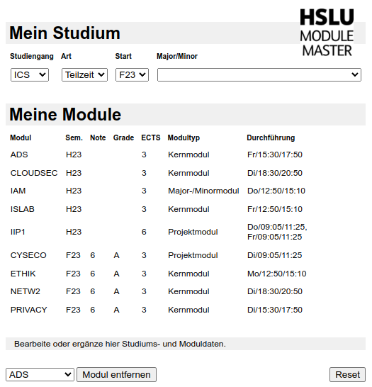
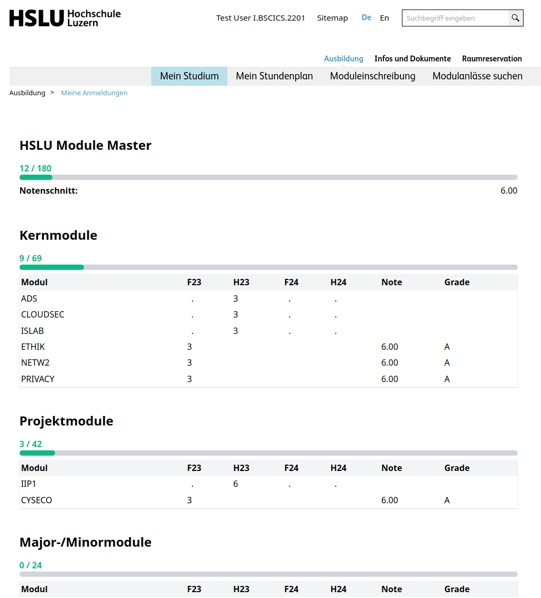
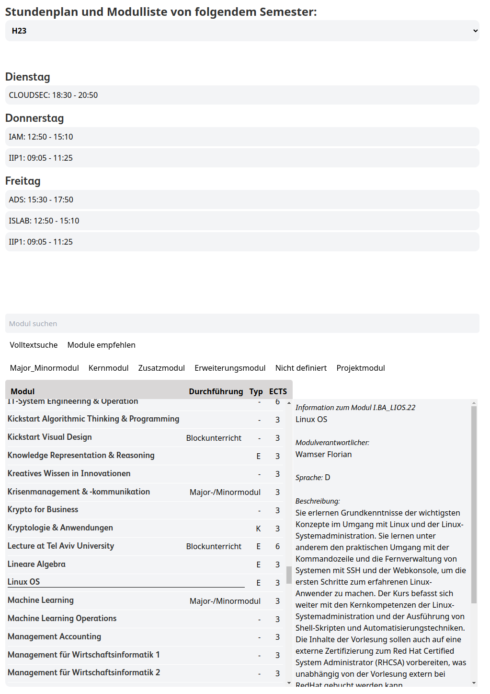
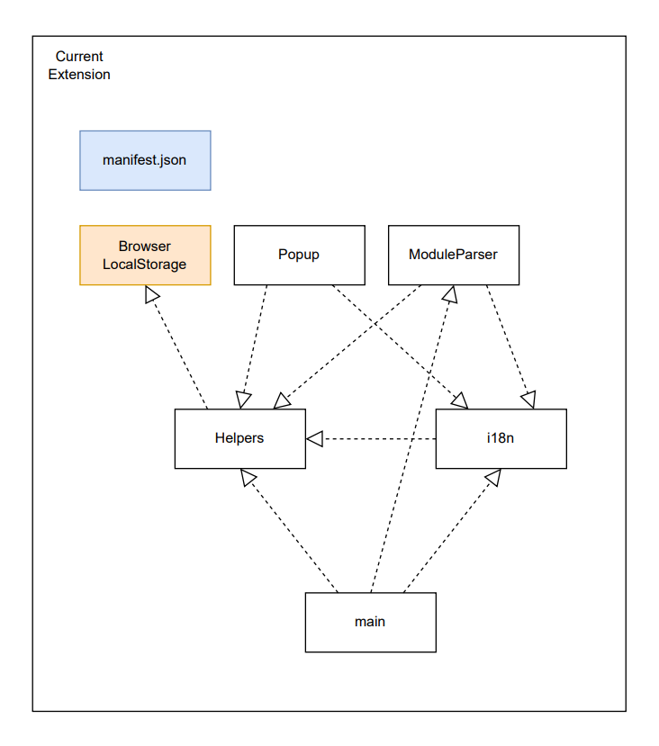
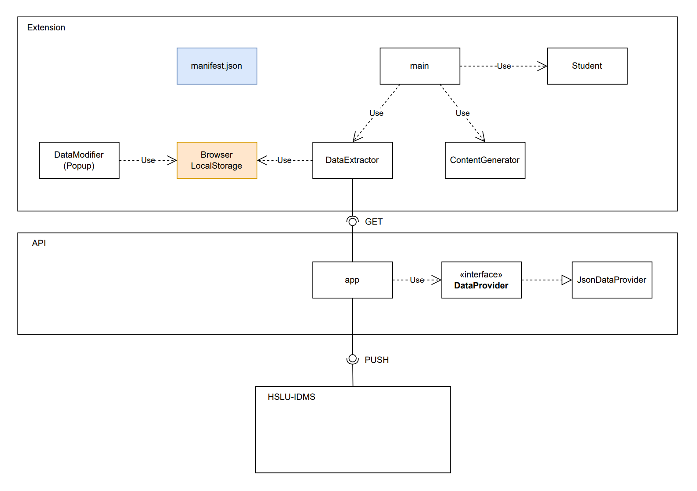

# HSLU Module Master / Studiengangverwalter
The Module Master is a browser extension designed for the MyCampus webpage. 
This project was developed with the objective of offering an enhanced solution for semester planning. It accomplishes this by extracting and presenting your MyCampus information in a well-organized manner. Additionally, we have implemented an interface to directly interact with IDMS Module data. This integration is realized through a web server hosting comprehensive module information for specified semesters. Consequently, this information is accessible to students beyond specific module registration timeframes. 
In collaboration with HSLU Informatik, we have established an agreement to ensure that new semester information will be promptly published to this web service as soon as it becomes available, facilitated by the responsible party at HSLU Informatik. 
The project was inspired by an [existing browser extension](https://github.com/eddex/hslu-simple-mep-results) with a similar purpose. Initially, our plan was to build upon this extension. However, upon careful consideration, we opted to develop our solution due to the added complexity of the existing code structure.
  Popup           |  Module Master   | Timetable and Modulelist
:-------------------------:|:-------------------------:|:-------------------------:
  |     | 

## Contributors
Students working on the Project:
- <a href="https://github.com/OAmezDroz" target="_blank">Oliver Amez-Droz</a> (olivier.amez-droz@stud.hslu.ch)
- <a href="https://github.com/A5TEX" target="_blank">Livio Biotti</a> (livio.biotti@stud.hslu.ch)
- David Koch (david.koch@stud.hslu.ch)
- <a href="https://github.com/Celine235" target="_blank">Celine235</a>
- spalinger

 HSLU Secretary's office contact:
- Selina Scherrer (selina.scherrer@hslu.ch)

 Coaches and Lecturers:
- Dieter Arnold (dieter.arnold@hslu.ch)
- Ron Porath (ron.porath@hslu.ch)
- Prof. Jordan Sucur (jordan.sucur@hslu.ch)

 Students maintaining the existing extension:
- [Lextum](https://github.com/Lextum)

## Features
- <b>Module Display:</b>
View all available modules in a given semester.

- <b>Module Descriptions:</b>
Read detailed descriptions for all modules.

- <b>Search Functionality:</b>
Effortlessly search for specific modules within selected semesters.

- <b>Filter Options:</b>
Apply selective filters to refine module search results.

- <b>Visited Module Tracking:</b>
Extract and display a comprehensive list of visited modules.

- <b>Study Schedule Visualization:</b>
Present your study schedule for a specific semester based on the extracted modules.

- <b>Module Type Overview:</b>
Provide an overview of visited module types, including Kernmodule, Projektmodule, Erweiterungsmodule, Zusatzmodule, and Major-/Minormodule.

- <b>Average Grade Calculation:</b>
Calculate your average grade based on your academic performance.

- <b>Manual Data Modification:</b>
Allow manual modification of extracted data, recognizing the need for user input and customization beyond automated extraction.

- <b>Persistent Data Storage:</b>
Ensure that all data persists within your browser, with no external data sharing.

- <b>Real-time Updates:</b>
Stay current with the latest information as the extension receives real-time data via the provided web service, eliminating the need for manual updates.

## Architecture
How does our Extension differ from the existing one:

### Existing Architecture
Our project drew inspiration from the existing extension [hslu-simple-mep-results](https://github.com/eddex/hslu-simple-mep-results). During the conceptualization of our extension, we extensively analyzed the structure of the existing solution to gain insights into problem-solving approaches. We constructed a dependency map, outlining the components of their application (refer to the diagram below). This evaluation led us to the realization that modifying the existing extension to meet our requirements within the given timeframe set by our coaches was impractical. Consequently, we opted to leverage some of their implementations in specific areas while entirely redesigning the architecture of the extension. An exception to this redesign was the adoption of a similar approach to theirs for extracting data from MyCampus.

### New Architecture
Our new architecture was developed with a dedicated web service in mind, responsible for supplying the extension with the necessary IDMS data.

#### Extension
The extension, serving as the client installed in the user's browser, comprises the following components:

##### Student
The Student class manages individual student data, calculates user-specific statistics, and facilitates the persistence of this data across sessions.

##### ContentGenerator
The ContentGenerator class is responsible for rendering various elements of the extension onto the MyCampus webpage.

##### DataExtractor
The DataExtractor class interfaces with our web service (API) and the local storage of the browser. This includes extracting user data from MyCampus.

##### main
The main module coordinates interactions between all classes, utilizing the DataExtractor to retrieve necessary data for the Student and ContentGenerator.

##### DataModifier (Popup)
The DataModifier or Popup module exists to modify and add data to the saved student object in local storage. This module operates relatively independently, with its sole dependency being the structure of the student object in local storage.

#### API
The API or web service provides up-to-date information from IDMS through its POST access point.

##### DataProvider
The DataProvider interface serves as a blueprint for both the JsonDataProvider and any prospective future access points, such as a direct interface with IDMS.

##### JsonDataProvider
The JsonDataProvider class implements the DataProvider interface. Its primary responsibility is to read JSON files from the file system and furnish the content to the web server.

#### HSLU-IDMS
Upon completion of the study schedule each semester, the responsible party from HSLU Informatik uploads a JSON dump containing all information for the upcoming semester. This information is immediately accessible to all students.

  

# Installation of Module Master Extension

## Installation from store
- This is planned. For now install from a local file.
<!-- Simply visit the respective browser extension store (Chrome Web Store, Microsoft Edge Add-ons, or Mozilla Add-ons) and search for "HSLU Module Master." Click on the "Add" or "Install" button to add the extension to your browser. -->

## Installation from local files

1. Download or clone the project folder from [GitHub](https://github.com/A5TEX/HSLU-Module-Master).
2. Unpack the project folder if necessary.

### Chrome
- Open Google Chrome and navigate to: `chrome://extensions`
- Activate Developer mode (top right of the screen).
- Click on "Load unpacked" extension (top left of the screen).
- Select the `src` folder inside the downloaded project folder.
- Open MyCampus and navigate to: "Meine Anmeldungen."
- Wait until the extension is loaded; this might take up to 20 seconds the first time.

### Edge
- Open Microsoft Edge and navigate to: `edge://extensions`
- Activate Developer mode (center left of the screen).
- Click on "Load unpacked" extension (top right of the screen).
- Select the `src` folder inside the downloaded project folder.
- Open MyCampus and navigate to: "Meine Anmeldungen."
- Wait until the extension is loaded; this might take up to 20 seconds the first time.

### Firefox (Not Recommended)
- Open Mozilla Firefox and navigate to: `about:debugging#/runtime/this-firefox`
- Click on "Load Temporary Extension" (top right of the screen).
- Navigate to the downloaded project folder, open the `src` folder, and select the `manifest.json` file.
- Open MyCampus and navigate to: "Meine Anmeldungen."
- Wait until the extension is loaded; this might take up to 20 seconds.
- **Note: Firefox removes all temporarily loaded extensions after it is closed.**
  
# Updating the Extension

1. Pull or download the latest version from [GitHub](https://github.com/A5TEX/HSLU-Module-Master).

### Chrome
- Open Google Chrome and navigate to: `chrome://extensions`
- Click the reload button next to the on/off slider for the HSLU Module Master extension. (Make sure it is active; otherwise, the button won't appear.)

### Edge
- Open Microsoft Edge and navigate to: `edge://extensions`
- Click the reload button for the HSLU Module Master extension. (Make sure it is active; otherwise, the button won't appear.)

### Firefox
- Open Mozilla Firefox and navigate to: `about:debugging#/runtime/this-firefox`
- Click the "Reload" button.
- **Note: The extension has to be temporarily loaded every time the browser is closed.**
